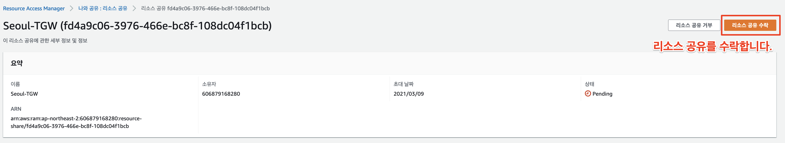

# TransitGateway 멀티어카운트

## 1.Transit Gateway MultiAccount 연결

### 개요

Transit Gateway는 동일 리전에서 서로 다른 계정에서 Transit Gateway Peering을 사용할 수 없습니다.

예를 들어 빌더스 컴퍼니와 협력사인 서밋 컴퍼니는 상호간에 Transit Gateway Peering을 동일 리전에서 연결할 수 없습니다. 이러한 경우 RAM(Resource Access Manager)를 통해서 간단하게 연결할 수 있는 디자인을 제공하고 있습니다.

아래와 같이 서울 리전안에서 2개의 계정간에 개발 협력을 위해 연결하는 과정을 소개합니다.

### RAM (Resource Access Manager) 소개

AWS Resource Access Manager (RAM)는 AWS 계정 또는 AWS 조직 내에서 AWS 리소스를 쉽고 안전하게 공유 할 수있는 서비스입니다. AWS Transit Gateway, 서브넷, AWS License Manager 구성 및 Amazon Route 53 Resolver 규칙 리소스를 RAM과 공유 할 수 있습니다.

많은 조직은 관리 또는 비용처리에 대한 부분에 대해 상호간의 영향 제한하기 위해 여러 계정을 사용합니다. RAM을 사용하면 여러 계정에 중복 리소스를 만들 필요가 없으므로 소유 한 모든 단일 계정에서 해당 리소스를 관리하는 운영 오버 헤드가 줄어 듭니다. 여러개 계정 환경에서 중앙 집중식으로 리소스를 생성하고 RAM을 사용하여 리소스 공유 생성, 리소스 지정 및 계정 선이라는 세 가지 간단한 단계로 계정간에 해당 리소스를 공유 할 수 있습니다. RAM은 추가 비용없이 사용할 수 있습니다.

**RAM을 사용하면 다음과 같은 장점이 있습니다.**

**운영 오버 헤드 감소**

중앙에서 AWS 리소스를 조달하고 RAM을 사용하여 서브넷 또는 라이선스 관리자 구성과 같은 리소스를 다른 계정과 공유합니다. 이렇게하면 다중 계정 환경의 모든 계정에 중복 리소스를 프로비저닝 할 필요가 없으므로 모든 계정에서 해당 리소스를 관리하는 운영 오버 헤드가 줄어 듭니다.

**보안 및 가시성 향상**

RAM은 AWS Identity and Access Management (IAM)에 설정된 기존 정책과 권한을 활용하여 공유 리소스의 사용을 관리합니다. RAM은 또한 Amazon CloudWatch 및 AWS CloudTrail과의 통합을 통해 알람를 설정하고, 로그를 시각화하기 위해 공유 리소스에 대한 포괄적 인 가시성을 제공합니다.

**비용 최적화**

계정간에 AWS License Manager 구성과 같은 리소스를 공유하면 회사의 여러 부분에서 라이선스를 활용하여 활용도를 높이고 비용을 최적화 할 수 있습니다.

### 구성 아키텍쳐 소개

[TransitGateway 구성하기](https://github.com/whchoi98/builders20210312/blob/master/transitgateway-basic.md)에서 생성한 빌더스 컴퍼니의 Transit Gateway를 동일한 서울 리전, 다른 어카운트(서밋 컴퍼니) Seoul-VPC-PART VPC에서 사용하려고 하는 목표 구성입니다.

AWS RAM(Resource Access Manager)를 이용하여 빌더스 컴퍼니의 Transit Gateway를 연계해서, 협력사인 서밋 컴퍼니 자원을 사용해 봅니다.

.png>)

## 2.서로 다른 계정에서 TGW 연동

### Task 1. VPC 구성하기

**`새로운 계정에 접속`** 하고, Cloudformation을 통해 기본이 되는 VPC구성을 먼저 구성합니다.

**1.사전 준비하기**

Task 들을 수행하기 위해서, 새로운 계정에도 Cloud9을 구성하는 것이 좋습니다. Cloud9에는 아래와 같이 동일하게 aws cli, ssm plugin 등을 설치해 둡니다.

```
cd ~/environment
git clone https://github.com/whchoi98/tgw.git
# AWS CLI upgrade
curl "https://awscli.amazonaws.com/awscli-exe-linux-x86_64.zip" -o "awscliv2.zip"
unzip awscliv2.zip
sudo ./aws/install
source ~/.bashrc
# aws cli 자동완성 설치 
which aws_completer
export PATH=/usr/local/bin:$PATH
source ~/.bash_profile
complete -C '/usr/local/bin/aws_completer' aws
##ssm plugin install
curl "https://s3.amazonaws.com/session-manager-downloads/plugin/latest/linux_64bit/session-manager-plugin.rpm" -o "session-manager-plugin.rpm"
sudo yum install -y session-manager-plugin.rpm

```

**2.Cloudformation 생성.**


**서밋 컴퍼니는 서울리전에서 새로운 계정의 Seoul-VPC-PART라는 이름으로 VPC를 생성합니다.**


**`Seoul-VPC-PART`** 를 Cloudformation 을 기반으로 생성합니다.

Cloud9에서 아래와 같이 수행하여, 배포 합니다.&#x20;

* Seoul-VPC-PART 배포&#x20;

```
aws cloudformation deploy \
  --stack-name "Seoul-VPC-PART" \
  --template-file "/home/ec2-user/environment/tgw/Seoul-VPC-PART.yml" \
  --capabilities CAPABILITY_NAMED_IAM \
  --parameter-overrides "KeyPair=mykey"

```

정상적으로 구성되면 아래와 같이 Cloudformation에서 확인 할 수 있습니다. VPC는 각 3분 내외에 생성됩니다.

.png>)

서밋 컴퍼니 계의 번호를 복사해 둡니다. RAM 구성시 계정 정보가 필요합니다.

[.png)](https://github.com/whchoi98/builders20210312/blob/master/.gitbook/assets/image%20\(52\).png)

### Task 2. RAM 구성하기

**이제 다시 빌더스 컴퍼니 계정에서 수행합니다.**


빌더스 컴퍼니에서 생성된 TGW를 서밋 컴퍼니에게 제공할 것입니다. 반드시 RAM 구성은 리소스 제공하는 계정에서 실행합니다.


**AWS 관리콘솔에서 RAM 을 선택하고, 새로운 윈도우 창을 오픈합니다.**

**`빌더스 계정 - AWS 콘솔 - RAM`**

.png>)

**`Resource Access Manager - 내가 공유: 리소스 공유`** 에서 **`"리소스 공유 생성"`** 을 선택합니다.

.png>)

아래와 값을 입력합니다.

* **이름** - "리소스 공유 이름" 을 입력합니다.

```
Seoul-TGW
```

* `리소스 유형 선택 - 전송 게이트웨이 (Transit Gateway)`를 선택하고, 생성해 놓은 TGW를 선택합니다.
* **`Principal - 외부 계정`** 허용 을 선택합니다. 앞서 새롭게 Seoul-VPC-PART VPC 자원이 생성된 계정의 번호를 입력합니다. (앞서 복사해 둔 서밋 컴퍼니의 계정입니다.)

Step1. 리스스 공유 세부 정보 지정&#x20;

리소스 공유를 확인하고, 생성한 리소스 공유를 선택합니다.

 (1) (1) (1) (1) (1) (1) (1).png>)

Step2. 권한을 각 리소스 유형과 연결&#x20;

 (1) (1) (1) (1) (1) (1) (1) (1).png>)

Step3. 액세스 할 수 있는 보안 주체 선택 - TransitGateway 자원을 연결할 다른 계정을 입력하고, "추가"를&#x20;

합니다. 선택한 보안 주체에 해당 계정이 정상적으로 입력되었는 지 확인합니다.   Associating 단계로 진행 중인 것을 확인 할 수 있습니다.

 (1) (1) (1) (1) (1) (1) (1).png>)

공유 리소스가 "Associated" 되었는지 확인합니다. 공유한 프린시펄에서 Associated 단계가 되도록 새로 만든 계정에서 RAM 에서 수락해야 합니다.&#x20;

 (1) (1) (1) (1) (1) (1).png>)

이제 공유를 확인하기 위해, 협력사인 서밋 컴퍼니 계정 콘솔로 이동해서 RAM으로 이동합니다.

**`서밋 컴퍼니 - AWS 계정 - RAM`** 을 선택합니다.

`리소스 공유`에 `초대 알람`이 생성된 것을 확인 할 수 있습니다. 리소스 공유를 선택합니다.

.png>)

해당 리소스 공유를 선택하면, 리소스 공유 수락을 대기하고 있는 것을 확인 할 수 있습니다. 공유된 리소스 Seoul-TGW 를 선택합니다.

 (1).png>)

리소스 공유 수락을 선택합니다.



AWS 계정 - VPC - TransitGateway에 빌더스 컴퍼니 계정의 Seoul-TGW가 나타납니다.

.png>)

### Task 3. TGW 연동하기

서밋 컴퍼니  계정에서 Transit Gateway Attachment를 생성하기 위해, **`VPC - Transit Gateway - Transit Gateway 연결`**을 선택해서 새로운 Attachment를 생성합니다.

* Transit Gateway ID : 공유된 TGW
* Attachment name tag : Attachment 이름 (Seoul-TGW-Attach-Seoul-VPC-PART)
* VPC ID : 서밋 컴퍼니의 VPC 선택 (Seoul-VPC-PART)
* Subnet : TGW ENI가 연결된 서브넷 선택 (Seoul-VPC-TGWSubnetA, Seoul-VPC-TGWSubnetB)

 (1) (1) (1) (1).png>)

**`VPC - Transit Gateway - Transit Gateway`** 연결 에서 정상적으로 구성되었는지 확인합니다 .&#x20;

.png>)

빌더스 계정에서 서밋 계정의 TGW 라우팅 테이블 Association을  수행합니다.


TGW와 Routing Table 자원은 모두 빌더스 컴퍼니 계정 소유 입니다. 따라서 Assocation, Routing Table 구성은 빌더스 계정에서 수행합니다.


**이제 다시 빌더스 계정으로 이동합니다.**

**`빌더스 계정 - AWS 콘솔 - VPC- Transit Gateway - Transit Gateway 라우팅 테이블`**에서 **`"Seoul-TGW-RT-East-To-West"`** 테이블을 선택합니다. 새롭게 추가된 서밋 컴퍼니 계정의 **Transit Gateway Attachment를 선택하고 추가**합니다.

 (1) (1) (1) (1) (1) (1) (1).png>)

 (1) (1) (1) (1) (1).png>)

**`AWS 콘솔 - VPC- Transit Gateway - Transit Gateway 라우팅 테이블 - "Seoul-TGW-RT-East-To-West" - Associations Tab`** 를 선택합니다. 정상적으로 Association 되었는지 확인합니다.

 (1) (1) (1) (1) (1) (1) (1).png>)

**`AWS 콘솔 - VPC- Transit Gateway - Transit Gateway 라우팅 테이블 - Propagations(전파) Tab`** 을 선택하고, 서밋 컴퍼니의 Seoul-VPC-PART 를 propagation(전파) 합니다.

 (1) (1) (1).png>)

 (1) (1) (1) (1) (1).png>)

**`AWS 콘솔 - VPC- Transit Gateway - Transit Gateway 라우팅 테이블 - Propagations(전파) Tab`** 을 선택하고, 정상적으로 Propagation(전파) 되었는지 확인합니다.

 (1) (1) (1) (1) (1) (1) (1).png>)

**`AWS 콘솔 - VPC- Transit Gateway - Transit Gateway 라우팅 테이블 - Route Tab`** 을 선택고, 정상적으로 Route가 추가되었는지 확인합니다.

 (1) (1) (1) (1) (1) (1).png>)

서밋 컴퍼니 계정에서 SEOUL-VPC-PRT-Private-10.4.21.101 을 접속합니다.

서밋 계정에도 (신규 계정) Cloud9으로 구성되어 있다면, 아래와 같이 Seoul-VPC-PART-Private-10.4.21.101 인스턴스 id를 조회합니다.

```
 ~/environment/tgw/aws_ec2_ext.sh |grep "Seoul-VPC-PART-Private-10.4.21.101"
 
```

Seoul-VPC-PART-Private-10.4.21.101 인스턴스에 접속합니다.

```
aws ssm start-session --target "Seoul-VPC-PART-Private-10.4.21.101 id"
```

아래 명령어를 통해 Seoul-VPC-DEV,STG 의 인스턴스로 연결이 가능한지 확인합니다.

```
sudo -s
echo 10.0.21.101 SEOUL-VPC-HQ-Private >> /etc/hosts 
echo 10.1.21.101 SEOUL-VPC-PRD-Private >> /etc/hosts
echo 10.2.21.101 SEOUL-VPC-STG-Private >> /etc/hosts
echo 10.3.21.101 SEOUL-VPC-DEV-Private >> /etc/hosts
echo 10.4.21.101 SEOUL-VPC-PRT-Private >> /etc/hosts
echo 10.5.21.101 IAD-VPC-Private >> /etc/hosts
ping SEOUL-VPC-DEV-Private

```

이제 Seoul-VPC-PART에서 Seoul-VPC-DEV, Seoul-VPC-STG로 통신을 하기 위해, 10.0.0.0/8의 목적지를 Transit Gateway로 추가합니다.

```
Seoul-VPC-PART-Private-Subnet-A-RT
```

 (1).png>)

 (1) (1) (1) (1) (1).png>)

.png>)


Seoul-VPC-PART에서 Seoul-VPC-PRD 로도 접근이 가능할 것입니다. 모든 VPC에서 10.0.0.0/8의 목적지를 TGW로 구성했 때문입니다. 보안 강화를 이러한 경우에는 VPC들의 CIDR을 Propagation 하지 않고, Static으로 처리하면 접근 제어가 가능합니다.&#x20;


이제 Seoul-VPC-PART-Private-10.4.21.101 에서 DEV, STG로 트래픽을 체크를 해보세요. PRD도 확인 해 보세요.

```
ping SEOUL-VPC-DEV-Private
ping SEOUL-VPC-STG-Private
ping SEOUL-VPC-PRD-Private
```


MultiAccount의 같은 리전에서 TGW 연동을 확인해 보았습니다. Propagation과 Static 조합을 통해서 VPC 격리와 보안을 강화하는 여러가지 디자인을 구성해 볼 수 있습니다.


****

****
